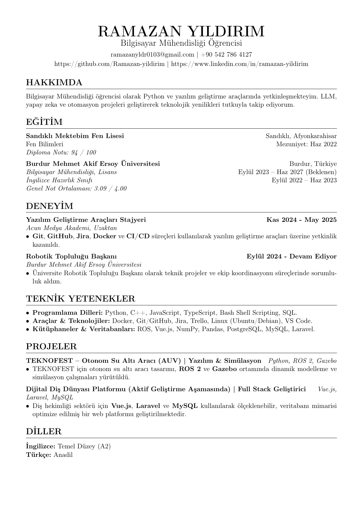
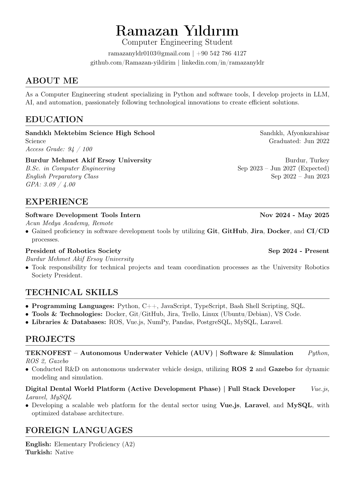

# Ramazan Yıldırım - Özgeçmiş (CV)

Bilgisayar Mühendisliği öğrencisi olarak Python ve diğer modern yazılım araçlarında edindiğim tecrübelerimi, akademik geçmişimi ve profesyonel yetkinliklerimi bu dokümanda bulabilirsiniz.

## 📄 CV İndir & İncele

Aşağıdaki bağlantılardan CV'min en güncel halini PDF formatında indirebilirsiniz:
*   [📥 **Türkçe CV İndir (PDF)**](output/Ramazan_Yildirim_CV_TR.pdf)
*   [📥 **English CV Download (PDF)**](output/Ramazan_Yildirim_CV_EN.pdf)

## 📌 Öne Çıkanlar

### Deneyim
*   **Acun Medya Akademi:** Yazılım Geliştirme Araçları Stajyeri (Git, Docker, CI/CD).
*   **MAKÜ Robotik Topluluğu Başkanı:** Ekip yönetimi ve teknik proje koordinasyonu.

### Teknik Yetkinlikler
*   **Diller:** Python, C++, JavaScript/TypeScript, SQL.
*   **Araçlar:** Docker, Kubernetes, Git, Jira.
*   **Frameworks:** Vue.js, Laravel, ROS 2.

## 👁️ Önizleme

<h3>Türkçe CV Önizlemesi</h3>

 

<h3>English CV Preview</h3>

 

