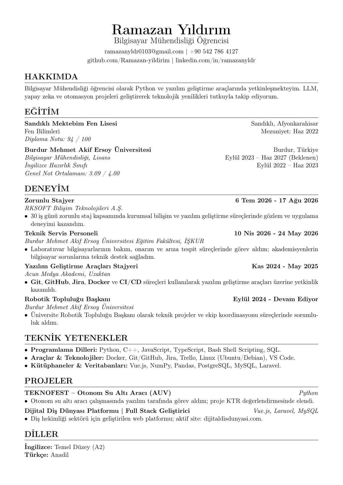
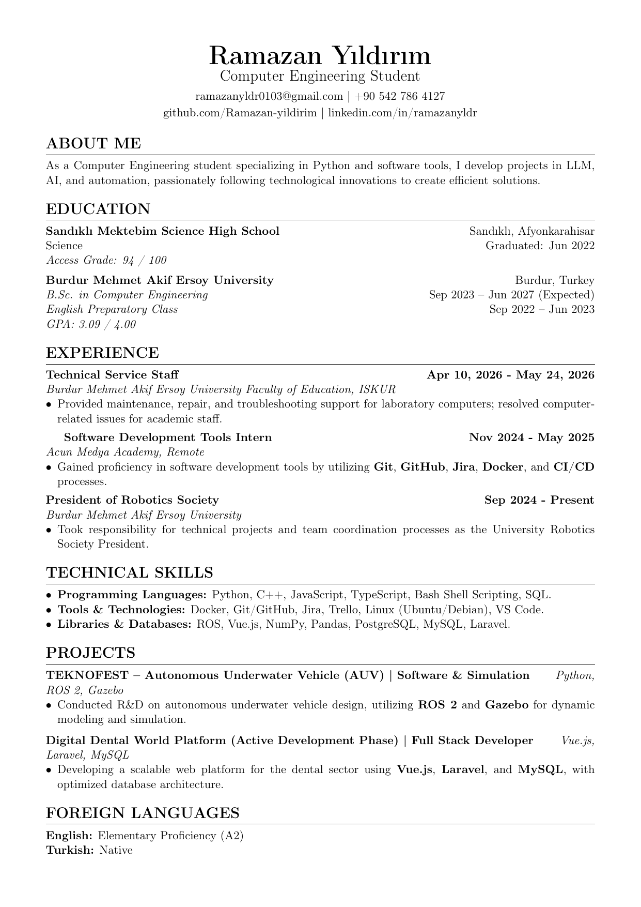

# Ramazan Yıldırım - Özgeçmiş (CV)

Yapay zeka, NLP ve LLM tabanlı uygulamalar ile full-stack web geliştirmeye odaklanan Bilgisayar Mühendisliği öğrencisi olarak deneyimlerimi, projelerimi ve teknik yetkinliklerimi bu dokümanda sunuyorum.

## 📄 CV İndir & İncele

Aşağıdaki bağlantılardan CV'min en güncel halini PDF formatında indirebilirsiniz:
*   [📥 **Türkçe CV İndir (PDF)**](output/Ramazan_Yildirim_CV_TR.pdf)
*   [📥 **English CV Download (PDF)**](output/Ramazan_Yildirim_CV_EN.pdf)

## 📌 Öne Çıkanlar

### Deneyim
*   **RKSOFT:** Python, Hugging Face Transformers, BERTurk ve WikiANN ile Türkçe NER modeli eğitimi; Precision, Recall, F1 değerlendirmeleri, hata analizi ve ChromaDB tabanlı vektör arama çalışmaları.
*   **Burdur Mehmet Akif Ersoy Üniversitesi:** Laboratuvar bilgisayarlarında bakım, onarım, arıza tespiti ve teknik destek.
*   **Acun Medya Akademi:** Git/GitHub, Jira, Docker ve CI/CD iş akışları.
*   **MAKÜ Robotik Topluluğu Başkanı:** Teknik proje, etkinlik ve ekip koordinasyonu.

### Projeler
*   **TEKNOFEST Otonom Su Altı Aracı (AUV):** Sistem tasarımı araştırması; kontrol mimarisi, sensör/donanım ve Python tabanlı yazılım yaklaşımının planlanması.
*   **Dijital Diş Dünyası:** Vue.js, Laravel ve MySQL ile geliştirilen aktif full-stack web platformu.

### Teknik Yetkinlikler
*   **Programlama:** Python, C++, JavaScript/TypeScript, SQL, Bash.
*   **Framework / Kütüphaneler:** Laravel, Vue.js, Hugging Face Transformers, NumPy, Pandas.
*   **Veritabanları:** PostgreSQL, MySQL, ChromaDB.
*   **Araçlar / Platformlar:** Docker, Git/GitHub, Linux, Jira, CI/CD.
*   **Dil:** İngilizce — Temel Seviye (A2).

## 👁️ Önizleme

<h3>Türkçe CV Önizlemesi</h3>

 

<h3>English CV Preview</h3>

 

