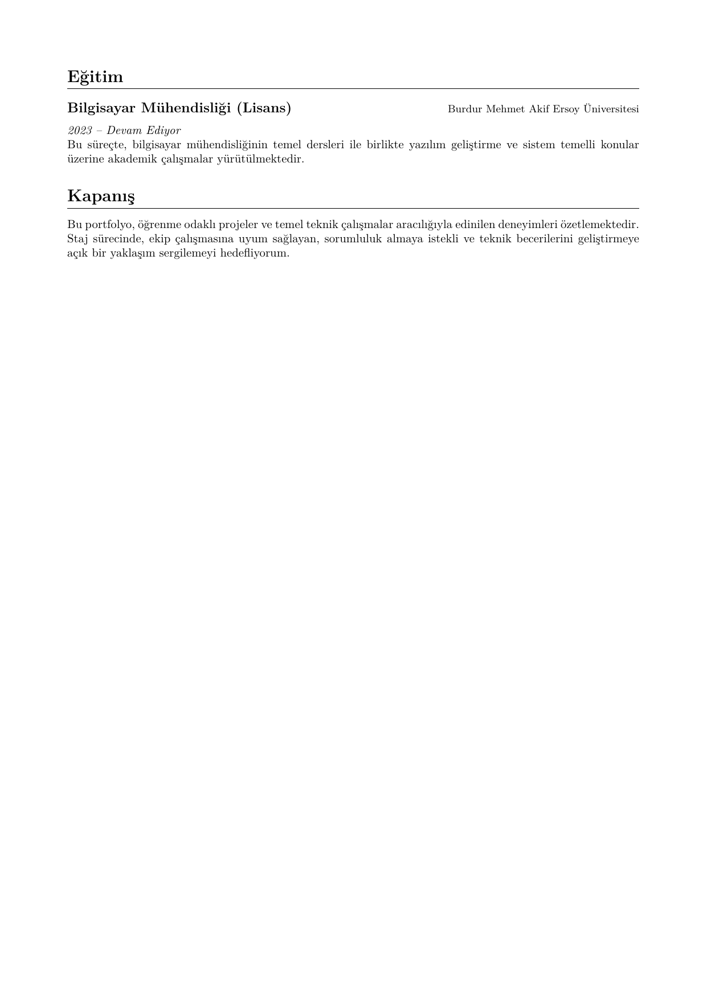

# Ramazan Yıldırım - Portfolyo

Bu portfolyo, bilgisayar mühendisliği eğitimim, staj deneyimlerim, yürüttüğüm projeler ve teknik yetkinliklerimi içermektedir.

## 📥 İndir
[**Ramazan Yıldırım Portfolyo İndir**](output/Ramazan_Yildirim_Portfolyo.pdf)

## 📄 İçerik
- **Projeler:** Otonom Sualtı Aracı, Dijital Diş Dünyası, Otomatik LaTeX CV ve Portfolyo Oluşturucu
- **Deneyim:** Yazılım Geliştirme Araçları Stajyeri (Acun Medya Akademi), Robotik Topluluğu Başkanı
- **Eğitim:** Burdur Mehmet Akif Ersoy Üniversitesi - Bilgisayar Mühendisliği
- **Teknolojiler:** Python, ROS 2, Vue.js, Laravel, Docker, LaTeX
