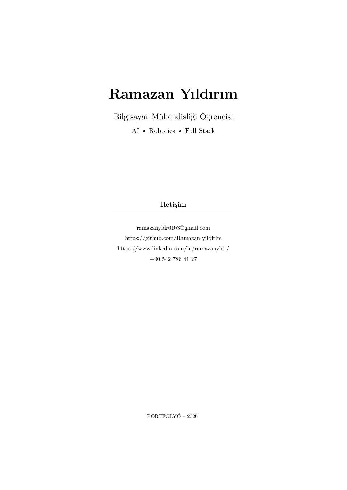
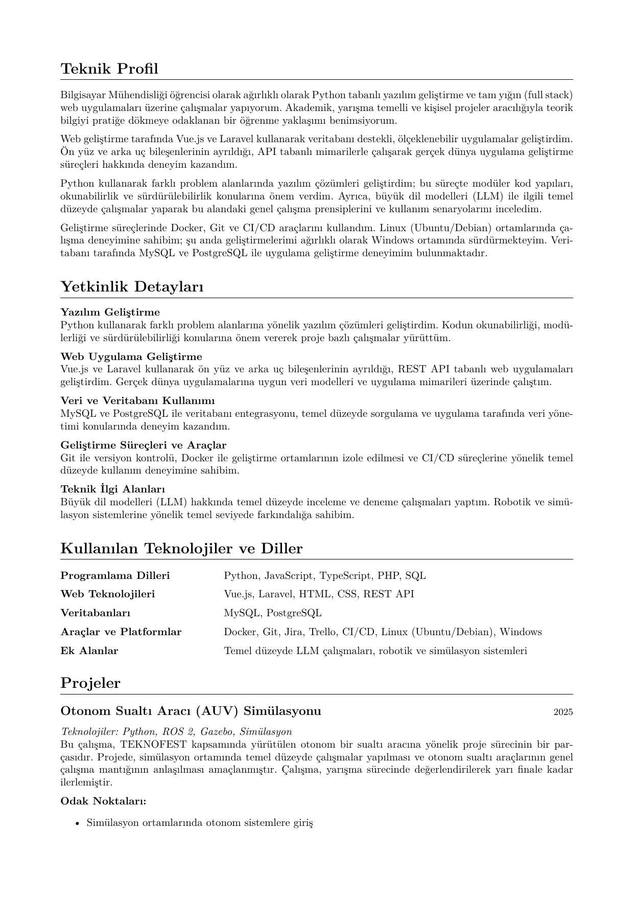
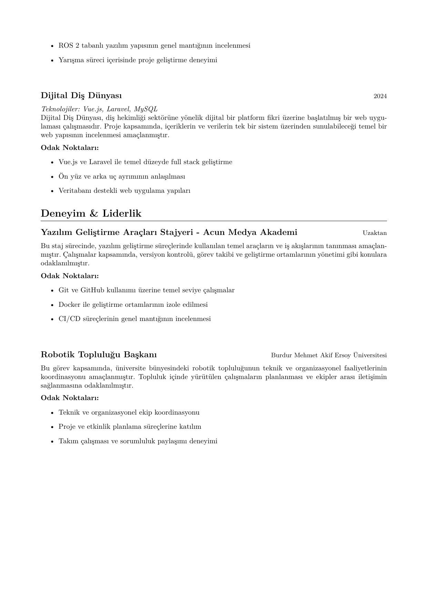

# CV & Portfolio Development Monorepo

Bu repository, **LaTeX** tabanlı Özgeçmiş (CV) ve Portfolyo projelerinin kaynak kodlarını ve otomatik derleme araçlarını içerir.

## 📄 İndirilebilir İçerik (PDF)

| Doküman | Dil | İndir |
| :--- | :--- | :--- |
| **CV** | Türkçe | [📥 İndir (PDF)](CV/output/Ramazan_Yildirim_CV_TR.pdf) |
| **CV** | English | [📥 Download (PDF)](CV/output/Ramazan_Yildirim_CV_EN.pdf) |
| **Portfolyo** | Türkçe | [📥 İndir (PDF)](portfolio/output/Ramazan_Yildirim_Portfolyo.pdf) |

## 👁️ Önizlemeler

<details open>
<summary><h3>CV Önizlemesi</h3></summary>
<br>
<div align="center">
  
  
</div>
</details>

<details>
<summary><h3>Portfolyo Önizlemesi</h3></summary>
<br>
<div align="center">
  
  
  <br>
  
  
</div>
</details>

---

## 📂 Proje Yapısı (Teknik Detaylar)

*   **`CV/`**: Özgeçmiş projesi.
    *   `src/`: LaTeX kaynak kodları.
    *   `src/metadata.tex`: Merkezi kişisel veri dosyası.
*   **`portfolio/`**: Portfolyo projesi.
    *   `src/`: LaTeX kaynak kodları ve görseller.

## 🚀 Kurulum ve Derleme (Windows)

Projeyi bilgisayarınıza klonladıktan sonra aşağıdaki yöntemlerle PDF çıktılarını üretebilirsiniz.

### Ön Gereksinimler
*   **Docker Desktop** (Yüklü ve çalışıyor olmalı)

### Tek Komutla Derleme
Kök dizindeki `build_all.bat` dosyasını çalıştırarak her iki projeyi de derleyebilirsiniz:

```powershell
.\build_all.bat
```
*Bu işlem Docker konteynerlerini ayağa kaldırır, LaTeX derlemesini yapar ve PDF dosyalarını `CV/output` ve `portfolio/output` klasörlerine kaydeder.*

## 🛠️ Geliştirme

### Kişisel Bilgileri Düzenleme
Ad, E-posta, Telefon gibi bilgileri değiştirmek için sadece şu dosyayı düzenlemeniz yeterlidir:
*   `CV/src/metadata.tex`

### Otomatik Derleme (CI/CD)
Bu repoda **GitHub Actions** kuruludur. `main` dalına yapılan her push işleminde:
1.  Sanal sunucuda temiz bir derleme yapılır.
2.  Oluşan PDF dosyaları **Artifact** olarak saklanır (Actions sekmesinden indirilebilir).
3.  Önizleme görselleri otomatik güncellenir.
