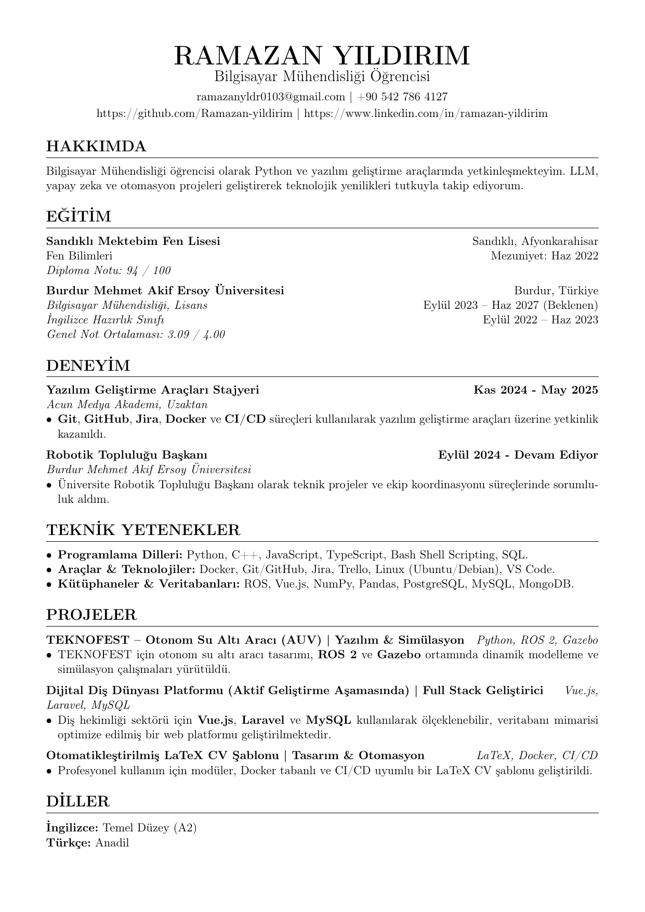
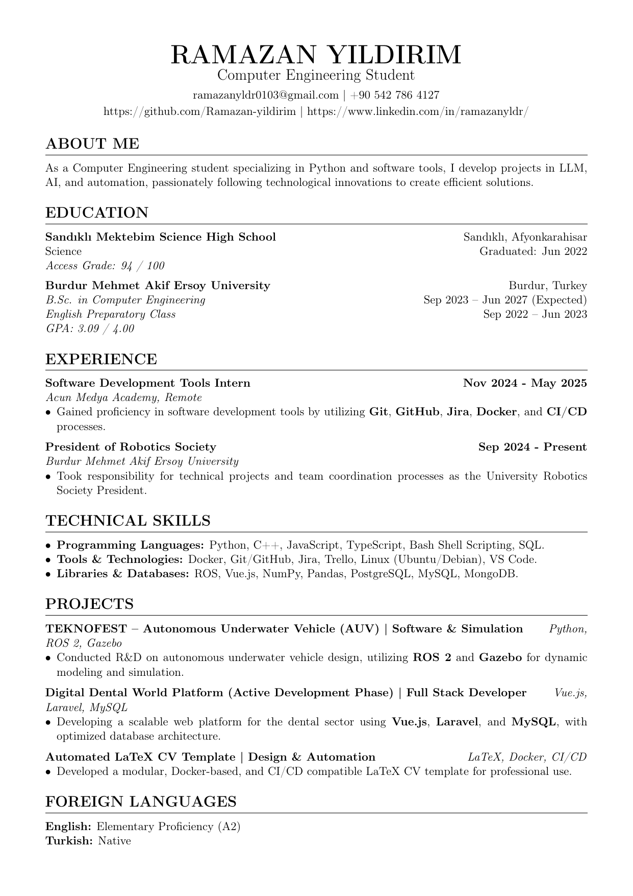

# 📄 LaTeX CV - Docker Builder

Bu proje, profesyonel CV hazırlamak için geliştirilmiş, Docker tabanlı ve modüler yapıda bir LaTeX şablonudur. Tek komutla hem Türkçe hem de İngilizce CV'nizi PDF formatında üretebilir, LaTeX kurulumuyla uğraşmadan içeriği kolayca yönetebilirsiniz.

## 👁️ CV Önizleme / Preview

### 🇹🇷 Türkçe CV


### 🇬🇧 English CV


## 📥 İndirme / Download

| Dil | Dosya |
|-----|-------|
| 🇹🇷 Türkçe | [**📂 PDF İndir (cv_tr.pdf)**](output/cv_tr.pdf) |
| 🇬🇧 English | [**📂 Download PDF (cv_en.pdf)**](output/cv_en.pdf) |

## ✨ Proje Özellikleri

- **Modüler Yapı**: CV bölümleri (Eğitim, Deneyim, Yetenekler) ayrı dosyalarda tutulur, yönetimi kolaydır.
- **Docker Tabanlı**: Bilgisayarınıza LaTeX kurmanıza gerek kalmaz.
- **Otomatik Önizleme**: Her derlemede güncel PNG önizlemeleri oluşturulur.
- **Çoklu Dil Desteği**: Aynı anda Türkçe ve İngilizce çıktı üretir.

## 🛠️ Kullanılan Teknolojiler

- **LaTeX**: Dizgi ve şablonlama.
- **Docker**: Konteynerizasyon ve çevre bağımsızlığı.
- **Bash/Batch Script**: Derleme otomasyonu.
- **Poppler Utils (pdftoppm)**: PDF'ten görüntüye dönüştürme.

## 🚀 Nasıl Build Edilir?

```bash
# Tek seferlik derleme + PDF açma
.\build.bat

# Watch mode - her 5 saniyede otomatik güncellenen derleme
docker-compose --profile watch up
```

## 📁 Proje Yapısı

```
├── src/
│   ├── main.tex              # Ana dosya
│   └── sections/
│       ├── header.tex        # İsim ve iletişim
│       ├── experience.tex    # İş deneyimi
│       ├── education.tex     # Eğitim
│       └── skills.tex        # Yetenekler
├── output/                   # PDF ve PNG çıktıları
├── Dockerfile
├── docker-compose.yml
└── build.bat
```

## 📝 Lisans

MIT License
