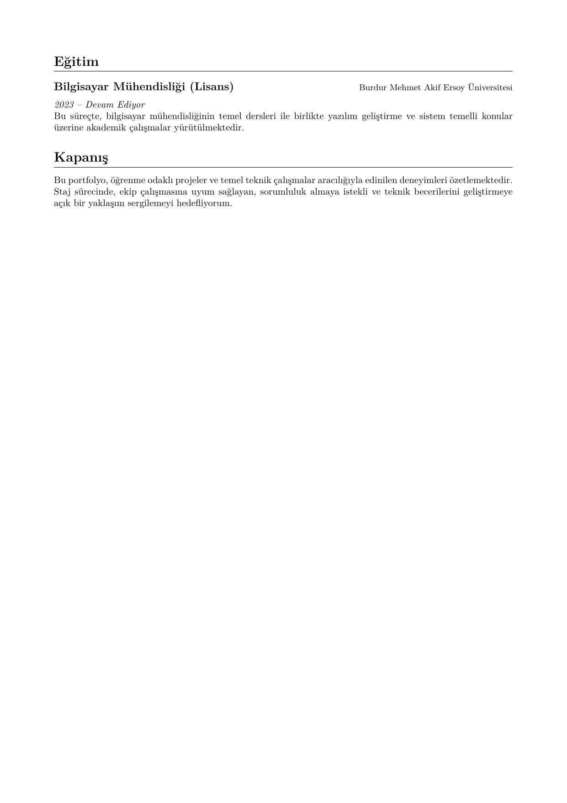

# Ramazan Yıldırım - Portfolyo

Eğitim hayatım ve kariyerim boyunca geliştirdiğim projelerin, katıldığım yarışmaların ve teknik detayların görsel sunumudur.

## 📥 Portfolyo İndir

Detaylı inceleme için PDF dosyasını indirebilirsiniz:
*   [📥 **Portfolyo PDF İndir**](output/Ramazan_Yildirim_Portfolyo.pdf)

## 🚀 Projeler Listesi
Bu portfolyoda yer alan bazı projeler:

1.  **TEKNOFEST Otonom Su Altı Aracı (AUV):** Sistem tasarımı araştırması; kontrol mimarisi, sensör/donanım ve Python tabanlı yazılım yaklaşımının planlanması.
2.  **Dijital Diş Dünyası:** Vue.js, Laravel ve MySQL tabanlı aktif full-stack web platformu: https://dijitaldisdunyasi.com/.
3.  **Otomatik LaTeX CV Oluşturucu:** Docker ve CI/CD süreçlerini içeren otomatik dokümantasyon projesi.

## 👁️ Önizleme

Sayfa Önizlemelerini Göster

| Sayfa 1 | Sayfa 2 |
| :---: | :---: |
|  |  |

| Sayfa 3 | Sayfa 4 |
| :---: | :---: |
|  |  |

